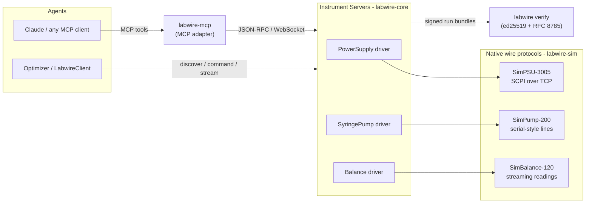

# Labwire

[](https://github.com/benchwire/labwire/actions/workflows/ci.yml)
[](LICENSE)

**An open protocol for AI-controlled laboratory instruments.** Think "MCP for
lab equipment": one universal way for AI agents to **discover** an
instrument's capabilities, **command** it, **stream** its measurements, and
walk away with **cryptographically signed** proof of what was done.

> Working title, protocol v0.2 draft. The wire protocol will change before
> 1.0. Feedback and prior-art corrections are very welcome; see
> [CONTRIBUTING.md](CONTRIBUTING.md).

<!-- demo GIF goes here once recorded: see docs/demo-gif.md -->

## Why

Self-driving labs need instruments that agents can operate safely and
auditably. Today every vendor speaks a different dialect and every
integration is bespoke. Labwire's bet is that the missing piece is small and
buildable now:

- **AI-agent-native.** Capability discovery modeled on MCP: an instrument
  describes its commands as JSON Schema, so any agent framework can drive it
  with zero glue code: the bundled [MCP adapter](packages/mcp) proves it.
- **Signed results.** Every run can produce an ed25519-signed manifest over
  the exact telemetry recorded: portable, tamper-evident evidence of what
  instrument did what, verified by one CLI command.
- **Safety and physical typing in the protocol.** Mandatory UCUM units on
  every quantity, S0-S3 safety classes with confirmation required for
  irreversible or hazardous actions, interlocks, cancellation, and typed
  errors with retryability. All specified in the protocol, not vendor add-ons.
- **Runnable by a stranger in 5 minutes.** Zero hardware: the reference
  implementation ships three realistic simulated instruments.

## Five-minute quickstart

```bash
git clone https://github.com/benchwire/labwire.git && cd labwire
make setup                       # uv installs Python 3.12 + everything
uv run examples/quickstart.py    # 60 s: drive a simulated balance end to end
uv run examples/streaming.py     # telemetry, cancellation, interlock recovery
make demo                        # closed-loop optimization + signed evidence
```

`make demo` runs a full autonomous experiment campaign: a scripted optimizer
tunes heater voltage and reagent flow rate across three simulated
instruments, converges on the hidden yield optimum, and ends by verifying the
winning run's signed bundle:

```
safety:      pump dispense is class S2 (irreversible); running under the operator standing grant
  run 13  V= 15.0 V -> T= 68.0 degC   q=  127 uL/min   yield= 87.2%   best= 87.2%
converged: best yield 87.2% at 15.0 V (68.0 degC), 127 uL/min in 14 experiments
signed evidence: demo_runs/d3b15e9f-...
  labwire verify: OK - authentic
```

`make demo-claude` runs the same loop with a **real Claude agent** planning
the experiments through the instruments' tool schemas (needs
`ANTHROPIC_API_KEY`; degrades gracefully to the scripted optimizer without
it).

## Architecture



The protocol is JSON-RPC 2.0 over WebSocket (stdio specified), with an
MCP-inspired initialize/capability handshake, a push-first command lifecycle,
sequenced telemetry, protocol-level safety interlocks, and normative signed
run manifests. The full specification lives at [spec/SPEC.md](spec/SPEC.md),
and every JSON example in it is machine-validated against the implementation
in CI.

## What's in the box

| Package | What it is |
|---|---|
| [labwire-core](packages/core) | Server + client SDKs, transports, session layer, signing, JCS |
| [labwire-sim](packages/sim) | Three realistic simulated instruments speaking native wire protocols |
| [labwire-drivers](packages/drivers) | Drivers wrapping those native protocols as Labwire instruments |
| [labwire-mcp](packages/mcp) | MCP adapter: every instrument command becomes an MCP tool |
| [labwire-cli](packages/cli) | `labwire verify <bundle>`: authenticate signed run evidence |
| [labwire-ophyd](packages/bridges/ophyd) | Bridge: serve any ophyd (Bluesky) device as a Labwire instrument |
| [labwire-pylabrobot](packages/bridges/pylabrobot) | Bridge: serve a PyLabRobot liquid handler as a Labwire instrument |
| [spec/](spec) | The protocol specification (v0.2 draft) |
| [examples/](examples) | Quickstart, streaming/recovery, and the closed-loop demo |

Wrapping your own device is a class and a decorator:

```python
class MyPump(Instrument):
    identity = IdentityInfo(manufacturer="You", model="Pump-1",
                            serial_number="001", firmware_version="1.0")
    flow = channel("flow_rate", unit="uL/min")   # UCUM codes are mandatory

    @command(
        units={"volume_ul": "uL", "rate_ul_min": "uL/min"},
        returns_units={"dispensed_ul": "uL"},
        safety_class="S2",                       # irreversible: needs confirmation
    )
    async def dispense(self, ctx: CommandContext,
                       volume_ul: float, rate_ul_min: float) -> dict[str, float]:
        """Dispense a volume at a controlled flow rate."""
        ...
```

## Drive it from Claude (MCP)

Serve a simulated instrument in one terminal:

```bash
uv run examples/serve_pump.py
```

Then expose it to any MCP client from another:

```bash
uv run labwire-mcp ws://127.0.0.1:9520
```

Every declared command appears as an MCP tool with its schema, units, and
identity, so Claude discovers and drives the hardware natively. See
[examples/mcp-config.json](examples/mcp-config.json) for a Claude-style MCP
server entry.

## Honesty and scope

The three instruments are **original simulated device models**, with
realistic latency, noise, drift, failure modes, and safety interlocks. They
are not emulations of any real vendor's hardware, and **no compatibility with
real instruments is claimed**. In the closed-loop demo, the chemistry between
devices is computed by the demo harness. Safety confirmation for S2/S3
commands proves deployment policy, not operator identity; cryptographic
operator binding is on the [roadmap](ROADMAP.md), not in v0.2. Non-goals for
now: fleet control, web UI, auth beyond a stub API key, real hardware
drivers, cloud hosting.

## Bring your own instruments (ophyd bridge)

Labwire does not aim to reimplement thousands of drivers. The
[ophyd bridge](packages/bridges/ophyd) exposes any classic
[ophyd](https://github.com/bluesky/ophyd) device, the hardware layer under
Bluesky that is widely used at synchrotron facilities, as a Labwire
instrument:

```bash
uv run labwire-ophyd annotate ophyd.sim:motor -o labwire-ophyd.yaml
make demo-ophyd     # a peak-finding scan over bridged ophyd.sim devices
```

ophyd knows a device's structure; it carries no units and no notion of risk.
A small YAML annotation file supplies those, the bridge refuses to serve a
device whose quantities have no UCUM unit, and actuation is classified S2 so
an agent must present an operator confirmation to move anything. Verified
against simulated devices and a soft EPICS IOC over Channel Access,
**never against physical hardware**; the package's LIMITATIONS section is
explicit about what that does and does not mean.

The [PyLabRobot bridge](packages/bridges/pylabrobot) does the same for liquid
handling, and was built to test something specific: ophyd devices are
*signal-shaped*, which is the shape this protocol was designed around, so
bridging them proved less than it looked like. A liquid handler's commands act
on things, and its state is a tree.

```bash
make demo-pylabrobot     # a serial dilution, with signed evidence
```

It works, and the places it strained are written down rather than smoothed
over. [SPEC-FINDINGS.md](SPEC-FINDINGS.md) is an honest list of eight of them,
with concrete recommendations for v0.3. The short version: v0.2 models actions
on quantities well and does not yet model things. References cannot be typed
the way units type numbers, and instrument state that is a tree has nowhere to
live.

## Prior art & positioning

Agent-to-instrument protocols became an active space in 2025-2026: **LAP**
([arXiv:2606.03755](https://arxiv.org/abs/2606.03755)) is a thoughtful
design specification for the same agent-to-instrument edge Labwire targets,
and **SCP** ([arXiv:2512.24189](https://arxiv.org/abs/2512.24189)) extends
MCP with a hub-mediated registry deployed at platform scale. Labwire and
LAP are independent convergent designs, and protocol v0.2 adopts two of
LAP's ideas, mandatory UCUM unit codes and the S0-S3 safety-class taxonomy,
with credit. The practical difference today is simple: LAP is a
specification without a published implementation, while Labwire is running
code, spec, SDKs, simulators, signed runs, an MCP adapter, and a
five-minute quickstart. [PRIOR_ART.md](PRIOR_ART.md) has the full honest
comparison, including MCP, SiLA 2, OPC-UA LADS, Bluesky/Ophyd, and
PyLabRobot, and what each does better than Labwire.

## Development

```bash
make check   # ruff + pyright strict + full test suite (exactly what CI runs)
```

See [CONTRIBUTING.md](CONTRIBUTING.md) for the process and quality gates,
and [ROADMAP.md](ROADMAP.md) for what is planned but not built.

## License

[Apache-2.0](LICENSE): the patent grant matters for a protocol.
